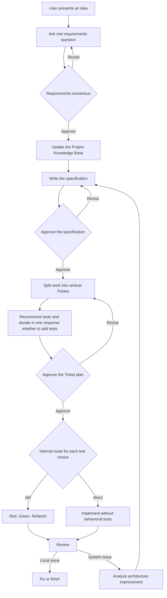

# Ask Then Do It: A Model-Neutral AI Development Workflow

Ask Then Do It is based on one idea: before acting, an AI should ask questions to understand what the user actually needs and record important decisions in documents that can be reviewed.

## The problem it addresses

An AI can easily start writing code without enough information. This often leads to three problems:

- The result does not solve the user's real need.
- Different conversations develop different understandings of the project.
- An architecture problem triggers a large change before its impact is agreed upon.

Ask Then Do It separates these risks into clear stages: requirements consensus, specification, Tickets, a user-selected implementation mode for every Ticket, Review, and architecture improvement.

## Core, Codex Plugin, and Generic workflow

The method has three conceptual layers:

| Part | Role |
| --- | --- |
| Core | Defines the workflow, approval points, and safety boundaries shared by all models |
| Codex Plugin | Presents the workflow as nine Skills that Codex can select |
| Generic workflow | Presents the same workflow as long-form instructions for Gemini and other AI services |

Codex and other AI services use different interfaces, but none may skip approval of the requirements, specification, or Ticket plan.

## Complete workflow

## Why ask only one question at a time

A long list of questions is easy to answer incompletely, and decisions can interfere with one another. The workflow chooses the highest-impact unresolved question and includes a recommended answer and the main tradeoff.

This gives the user one clear decision at a time.

## Three human approval points

The AI must wait for explicit approval at three points:

1. Requirements consensus: confirm the problem, users, and scope.
2. Specification: confirm expected behavior and failure cases.
3. Ticket plan: confirm how the work will be divided and verified.

Silence, an unrelated reply, or an AI-generated state change cannot replace the user's approval.

## Project Knowledge Base

The Project Knowledge Base preserves approved terms, architecture, important decisions, external dependencies, and open questions over the life of the project.

New information from requirements discussions first remains a temporary note. It becomes part of the formal knowledge base only after the related decision is approved. This prevents assumptions from being mistaken for facts in later conversations.

## Vertical Tickets

Each Ticket should deliver a user-visible result that can be verified independently. If work is split into separate database, backend, and frontend Tickets, completing any one Ticket may still produce nothing usable.

A vertical Ticket includes the data, logic, and interface needed to deliver its result. After every Ticket is listed, the workflow gives each one a test recommendation with time and risk warnings. In one response, the user decides whether to add tests to every Ticket: all, none, or an explicit subset. The plan is approved only after every choice is resolved.

## TDD, direct implementation, and evidence

TDD follows Red, Green, and Refactor:

- Red demonstrates that the test detects behavior that has not yet been implemented.
- Green demonstrates that the minimum implementation now passes the test.
- Refactor improves the design while tests continue to pass.

The workflow keeps the actual commands and test results so that completion is supported by evidence, not only a written claim.

When the user declines tests, the workflow uses the internal `direct` path; declining tests for every Ticket is also valid. The direct path does not create or run behavioral tests, although it may run lint, type-check, or build checks. Its evidence and Review retain `tests: skipped-by-user`, identify untested behavior, and do not claim TDD-equivalent confidence.

## Review from twelve perspectives

Review checks the approved material, code changes, and verification results. It uses twelve consistent perspectives to examine duplication, long functions, overloaded responsibilities, data that repeatedly travels together, changes scattered across the system, and interfaces that expose unnecessary details.

Every conclusion should point to evidence. Missing information must be marked as unverified rather than treated as proof that no problem exists.

## Why architecture improvement begins with analysis

Architecture problems often affect multiple features. Immediate restructuring may go beyond the approved scope, so architecture improvement first:

- Describes the problem and its impact.
- Traces related modules and dependencies.
- Examines what would happen if a module were removed.
- Prioritizes improvement options.

Accepting the analysis does not authorize implementation. Changes still return through specification, Ticket planning, the user's per-Ticket mode selection, and the matching implementation path.

## Working with different AI capabilities

An AI with conversation access can ask questions, prepare documents, and analyze material supplied by the user, but it must not claim to have edited files or run tests.

An AI with file and command tools can make and verify changes, but it must still provide evidence. If the host supports an independent reviewer, Review can add a perspective that is not influenced by the implementer's conclusion.

The workflow adapts to real capabilities and never pretends to perform actions that the host cannot support.

## Read next

- [Beginner's Workflow Guide](../guides/getting-started-simple.en.md)
- [Codex Plugin Guide](../guides/codex.en.md)
- [Generic Guide](../guides/generic.en.md)
