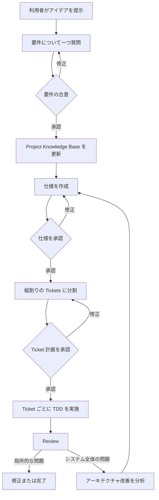

# Ask Then Do It：モデルに依存しない AI 開発フローの設計

Ask Then Do It の中心となる考え方は単純です。AI は作業を始める前に質問を行い、利用者が本当に必要としているものを確認し、重要な決定を確認可能な文書に残します。

## 解決する問題

AI は情報が不足していてもコードを書き始めてしまうことがあります。その結果、主に次の問題が起きます。

- 完成した機能が利用者の本当の要望と異なる。
- 会話ごとにプロジェクトへの理解が変わる。
- アーキテクチャ上の問題を見つけた後、影響を確認せずに大きな変更を始める。

Ask Then Do It は、要件の合意、仕様、Tickets、TDD、Review、アーキテクチャ改善を明確な段階に分け、これらのリスクを管理します。

## Core、Codex Plugin、Generic workflow

この方法には 3 つの概念的な層があります。

| 部分 | 役割 |
| --- | --- |
| Core | すべてのモデルに共通するフロー、承認点、安全上の境界を定義する |
| Codex Plugin | Codex が選択できる 8 個の Skills としてフローを提供する |
| Generic workflow | 同じフローを Gemini などの AI に貼り付けられる長文の指示として提供する |

Codex とその他の AI では操作方法が異なりますが、要件、仕様、Ticket 計画の承認は省略できません。

## フロー全体

## 一度に一つだけ質問する理由

多くの質問を一度に行うと回答漏れが起きやすく、決定同士が影響し合います。このフローでは、影響が最も大きく、まだ決まっていない質問を優先し、推奨回答と主なトレードオフを添えます。

利用者は毎回一つの明確な判断に集中できます。

## 3 つの承認点

AI は次の 3 か所で利用者の明確な承認を待ちます。

1. 要件の合意：解決する問題、利用者、範囲を確認する。
2. 仕様：期待する動作と失敗時の動作を確認する。
3. Ticket 計画：作業の分け方と確認方法を決める。

無回答、関係のない返答、AI 自身による状態変更は、利用者の承認の代わりになりません。

## Project Knowledge Base

Project Knowledge Base は、承認済みの用語、アーキテクチャ、重要な決定、外部依存、未解決事項を長期的に保存します。

要件の話し合いで得た新しい情報は、最初は一時的なメモとして扱います。関連する決定が承認された後にだけ正式な知識へ反映します。これにより、推測が後の会話で事実として扱われることを防ぎます。

## 縦割りの Tickets

各 Ticket は、個別に確認できる利用者向けの結果を届けます。データベース、バックエンド、フロントエンドを別々の Ticket にすると、どれか一つを完了しても使える機能にならない場合があります。

縦割りの Ticket には、その結果に必要なデータ、ロジック、画面や接点、テストをまとめて含めます。

## TDD と実装の根拠

TDD は Red、Green、Refactor の順で進めます。

- Red は、未実装の動作をテストが検出できることを示します。
- Green は、最小限の実装でテストが通ることを示します。
- Refactor は、テストを通したまま設計を整理します。

このフローでは実際のコマンドとテスト結果を残し、文章による主張だけでなく根拠によって完成を示します。

## 12 の視点による Review

Review は、承認済みの内容、コード差分、確認結果を照らし合わせます。12 の共通した視点から、重複、長すぎる関数、責任の集中、一緒に扱われ続けるデータ、変更箇所の分散、不要な内部情報を見せるインターフェースなどを調べます。

各結論には根拠が必要です。情報が不足している場合は、問題がないと判断せず、未確認であることを示します。

## アーキテクチャ改善を分析から始める理由

アーキテクチャ上の問題は複数の機能へ影響することがあります。すぐに構造を変えると承認済みの範囲を超える可能性があるため、最初に次のことを行います。

- 問題と影響を説明する。
- 関連するモジュールと依存関係を追跡する。
- モジュールを削除した場合の影響を調べる。
- 改善案の優先順位を決める。

分析の受け入れは実装の許可ではありません。実際の変更は、仕様、Ticket 計画、TDD を通して改めて進めます。

## AI の能力が異なる場合

会話だけができる AI は、質問、文書の整理、利用者が提示した内容の分析を行えます。ただし、ファイル編集やテスト実行を行ったと主張してはいけません。

ファイルやコマンドを扱える AI は変更と確認を実行できますが、その根拠を提示する必要があります。独立した確認役を利用できる環境では、Review に実装者の結論に影響されない視点を追加できます。

フローは実際に利用できる能力に合わせて進み、利用できない操作を行ったようには見せません。

## 次に読む

- [初心者向けフロー](../guides/getting-started-simple.ja.md)
- [Codex Plugin 使用ガイド](../guides/codex.ja.md)
- [Generic 使用ガイド](../guides/generic.ja.md)
