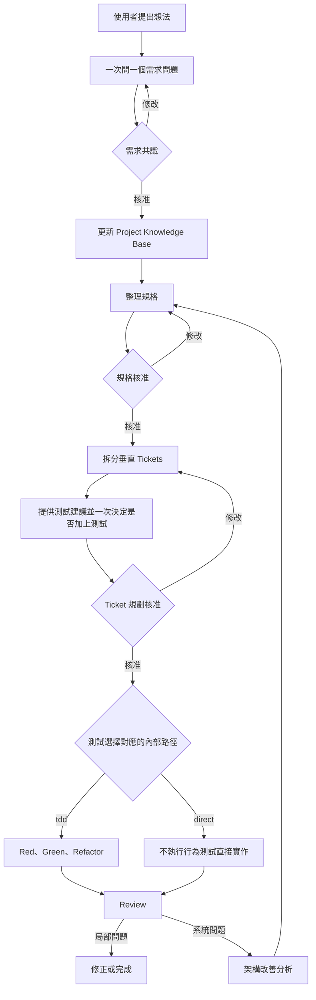

# Ask Then Do It：模型中立的 AI 開發流程設計

Ask Then Do It 的核心想法是：AI 在動手以前，先透過問題確認使用者真正需要什麼，並把每個重要決定留在可檢查的文件中。

## 要解決的問題

AI 很容易在資訊不足時直接產生程式碼。這通常造成三種結果：

- 做出的功能不是使用者真正需要的。
- 不同對話對專案的理解不一致。
- 發現架構問題後直接大改，卻沒有重新確認影響。

Ask Then Do It 使用需求共識、規格、Tickets、每張 Ticket 由使用者選定的實作模式、Review 與架構改善，把這些風險拆成可確認的階段。

## Core、Codex Plugin 與 Generic workflow

這套方法分成三個概念層次：

| 部分 | 作用 |
| --- | --- |
| Core | 定義所有模型共同遵守的流程、核准點與安全界線 |
| Codex Plugin | 將流程提供為九個可由 Codex 選擇的 Skills |
| Generic workflow | 將相同流程整理成可貼到 Gemini 或其他 AI 的長文字工作流 |

Codex 和其他 AI 的操作方式不同，但需求核准、規格核准與 Ticket 規劃核准不能被省略。

## 完整流程

## 為什麼一次只問一題

一次詢問很多問題容易讓使用者漏答，也讓不同決策互相干擾。流程會優先選擇影響最大、最不確定的問題，並附上建議答案與主要取捨。

這讓使用者每次只需要做一個清楚的決定。

## 三個人類核准點

AI 必須等待三次明確核准：

1. 需求共識：確認要解決的問題、使用者與範圍。
2. 規格：確認成品應呈現的行為與失敗方式。
3. Ticket 規劃：確認工作如何拆分與驗證。

沉默、無關回覆或 AI 自己更改狀態都不能代替使用者核准。

## Project Knowledge Base

Project Knowledge Base 是專案的長期知識庫，保存已核准的名詞、架構、重要決定、外部依賴與待處理問題。

需求討論中的新資訊先當作暫時筆記。只有使用者核准相關決定後，才會更新正式知識庫。這可以避免猜測在後續對話中被誤認為事實。

## 垂直 Tickets

每張 Ticket 都應交付一個可以獨立驗證的使用者結果。若依資料庫、後端、前端分開拆工作，任何一張 Ticket 完成時都可能看不到可用功能。

垂直拆分會讓一張 Ticket 同時包含完成該結果所需的資料、邏輯與介面。所有 Tickets 列出後，流程會逐張提供測試建議與工時、風險提醒。使用者在一次回覆中決定每張 Ticket 是否加上測試，可以全部加上、全部不加，或指定部分 Tickets；所有選擇完成後才核准規劃。

## TDD、direct 實作與證據

TDD 使用 Red、Green、Refactor：

- Red 證明測試確實能抓到尚未完成的行為。
- Green 證明最小實作已讓測試通過。
- Refactor 在測試保護下整理設計。

流程要求保留實際命令與測試結果，避免只用文字宣稱功能已完成。

使用者選擇不加測試時，流程會使用內部 `direct` 路徑；所有 Tickets 都不加測試也有效。direct 路徑不建立也不執行行為測試，但可以執行 lint、type-check 或 build。它的證據與 Review 保留 `tests: skipped-by-user`、指出未測試行為，也不宣稱具備與 TDD 相同的信心。

## Review 與十二項視角

Review 會重新對照核准內容、程式差異與驗證結果，並使用固定的十二項視角檢查重複邏輯、過長函式、責任過多、資料群聚、修改散落與過度暴露內部細節等問題。

每項結論都要能指出證據。資料不足時應標示無法確認，不能把缺少證據當成沒有問題。

## 架構改善為什麼先分析

架構問題通常影響多個功能。直接重構可能超出原本核准範圍，因此架構改善先完成以下工作：

- 說明問題與影響。
- 追蹤相關模組與依賴。
- 模擬移除某個模組會造成什麼結果。
- 排定改善優先順序。

接受分析不等於允許動工。真正修改仍要回到規格、Ticket 規劃、每張 Ticket 的使用者模式選擇與對應實作路徑。

## 不同 AI 能力下的做法

只有對話能力的 AI 可以提問、整理文件與分析使用者貼上的內容，但不能宣稱已操作檔案或執行測試。

具備檔案和命令工具的 AI 可以實際修改與驗證，但仍必須提供證據。若主機還能提供獨立的檢查者，Review 可以增加另一個不受實作者結論影響的視角。

流程會依真實能力調整可以完成的工作，不會假裝執行主機不支援的操作。

## 閱讀下一步

- [初學者流程](../guides/getting-started-simple.zh-TW.md)
- [Codex Plugin 使用說明](../guides/codex.zh-TW.md)
- [Generic 使用說明](../guides/generic.zh-TW.md)
