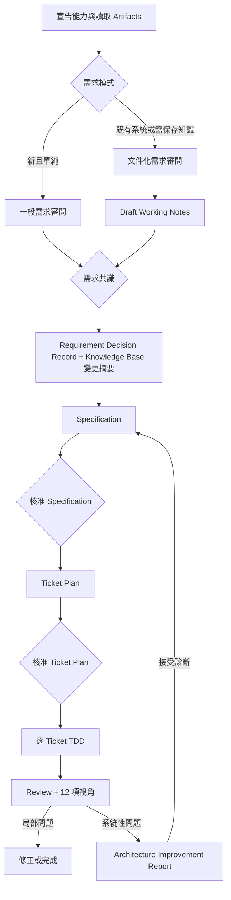

# 可攜式 AI 開發工作流：Core 1.0.0 設計說明

本文件是給人類閱讀的繁體中文設計說明。正式規則以已核准的 [Ask Then Do It 1.0.0 Specification](../specs/ask-then-do-it-1.0.0.md) 為準，實作順序以已核准的 [Ask Then Do It 1.0.0 Ticket Plan](../plans/ask-then-do-it-1.0.0.md) 為準。本文件只解釋概念，不取代英文規格。

## 要解決的問題

Ask Then Do It 的核心方法是「先問清楚，再寫規格、拆 Ticket、用 TDD 實作，最後 Review」。模型中立的 Core 已經把這套方法從 Codex 格式中抽離，但長期使用仍要處理三個問題：

- 新對話常要重新教 AI 專案術語、架構與決策。
- 不同模型做 Review 時，使用的重構詞彙與深度不一致。
- AI 發現架構問題後，容易直接提議動手重構，跳過產品規格與批准程序。

Core 因此包含「專案知識」、「固定 12 項檢查視角」和「只診斷、不直接動工的架構改善」三個能力。

## 三層架構仍然不變

| 層級 | 內容 | 使用方式 |
| --- | --- | --- |
| `core/` | 模型中立的規則、模組、Artifact 契約、固定 Rule ID | 所有 Adapter 都要遵守，不放任何主機專用呼叫語法 |
| `adapters/` | 把 Core 翻譯成 Generic prompts 或 Codex Skills | 可以配合主機特性改寫說法，但不能弱化規則 |
| `docs/` | Specification、Plan、設計說明、使用指南、驗證證據 | `specs/` 與 `plans/` 的英文檔是模型規範；`design/`、`guides/` 是給人看的說明 |

所以 `$ask-with-docs` 是 Codex 的入口名稱，`documented-requirements.md` 是 Generic 的入口名稱；兩者背後遵守相同的 Core 契約。

## 能力 Profiles

| Profile | 能做什麼 | 不能冒充什麼 |
| --- | --- | --- |
| `conversation` | 對話、一次問一題、產生 Markdown Artifacts、分析使用者提供的資料 | 不能說已讀寫 repository、已跑測試、已保存檔案或完成實際刪除實驗 |
| `tools` | 另可讀寫 repository、保存 Artifacts、執行命令與測試 | 沒有隔離 reviewer 時，不能說 Review 是獨立的 |
| `multi_agent` | 另可使用真正隔離的 worker 或 reviewer | 不能把共享實作者結論的 context 說成獨立 |

能力未知時一律從 `conversation` 開始。這個限制適用各種模型，不是 Codex 專用規則。

## 完整流程



原本的三個人類閘門仍然存在：需求共識、Specification 核准、Ticket Plan 核准。架構報告的 `accepted` 只代表接受診斷，不能替代這三個閘門。

## Project Knowledge Base

專案只維護一份正式 Project Knowledge Base，預設位置是：

`docs/project/knowledge-base.md`

它固定整理六類資訊：

1. Glossary：專有名詞。
2. Architecture map：重要模組與關係。
3. Important decisions：已批准的重要決策。
4. External dependencies：外部服務或套件。
5. Unresolved items：仍待決定或證據不足的事項。
6. Artifact links：Requirement、Specification 與 Ticket Plan 的連結。

AI 只能從已核准或已接受的證據更新正式 Knowledge Base。每次都要先列出 `additions`、`modifications`、`removals`；使用者核准上游 Artifact 時，只會一起批准當時看得到的變更。

## Draft Working Notes 為什麼分開

需求審問期間的資訊可能只是猜測、還沒確認，或不同文件互相衝突。這些內容先放進 Draft Working Notes，並標成：

- `proposed`：尚未確認。
- `confirmed`：使用者在審問中確認，但還沒通過正式 Artifact 核准。
- `unresolved`：證據不足或互相矛盾。

即使標成 `confirmed`，在 Requirement Decision Record 與 Knowledge Base 變更摘要被明確批准以前，也不能進入正式知識庫。

## 12 項架構與重構視角

`review-code` 會對本次變更快速掃描全部 12 項；`improve-architecture` 則對模組或系統做深入分析。

| # | Lens | 簡單意思 |
| --- | --- | --- |
| 1 | Duplicated Code or Policy | 同一規則散落多處 |
| 2 | Long Function | 函式太長或做太多事 |
| 3 | Large Module or Class | 模組或類別責任過多 |
| 4 | Long Parameter List | 介面需要太多零散參數 |
| 5 | Data Clumps | 同一群資料總是一起出現 |
| 6 | Primitive Obsession | 用沒有約束的基本型別表示重要領域概念 |
| 7 | Feature Envy | 程式更依賴別人的資料而不是自己的責任 |
| 8 | Divergent Change | 同一模組因很多不同原因一直修改 |
| 9 | Shotgun Surgery | 一個改動要散改很多地方 |
| 10 | Message Chains | 呼叫鏈太長並洩漏內部結構 |
| 11 | Leaky Abstraction | 使用者必須了解被隱藏的內部細節 |
| 12 | Shallow Module | 介面很複雜，實際隱藏的功能卻很少 |

每一項都要有證據，並標記 `finding`、`no-finding`、`not-applicable` 或 `unverified`。專案可以增加自己的視角，但不能刪除核心 12 項。

## Architecture Improvement Report

架構改善預設只做診斷。報告會說明範圍、架構摘要、12 項結果、證據、影響、信心、優先順序、受影響模組、未決問題與知識庫摘要。

「刪除測試」預設是模擬刪除：追蹤如果拿掉某個模組會影響哪些呼叫、資料、設定、測試和部署，但不真的刪檔。

實際刪除實驗必須同時具備：

1. 使用者清楚授權指定範圍。
2. 真正的 `tools` 能力。
3. 可以直接丟棄的隔離環境。

少一項就只能做模擬。報告即使變成 `accepted`，仍要回到 Specification、Ticket Plan 與 TDD，不能直接重構。

## 八種 Artifact

| Artifact | 用途 |
| --- | --- |
| Requirement Decision Record | 保存需求共識 |
| Specification | 定義可觀察行為 |
| Ticket Plan | 拆成垂直可測 Tickets |
| Implementation Evidence | 保存真實 red-green-refactor 證據 |
| Review Report | 回報局部變更的問題與證據限制 |
| Project Knowledge Base | 保存已批准的長期專案知識 |
| Draft Working Notes | 暫存審問中未正式批准的資訊 |
| Architecture Improvement Report | 保存系統層診斷，不直接授權重構 |

## 專案目錄

```text
core/
├─ CORE.md
├─ modules/              八個規範模組
├─ artifacts/            八種 Artifact 與共同欄位契約
├─ references/           12 項視角等共享參考
├─ rules/rules.yaml      穩定的 mandatory Rule ID
└─ adapters/             Adapter manifest 契約

adapters/
├─ generic-prompts/      模型中立的 Conversation prompts
└─ codex/                Codex Plugin、rule mapping 與遷移清冊

docs/
├─ specs/                英文正式行為規格
├─ plans/                英文實作計畫
├─ design/               給人看的設計理由
├─ guides/               操作說明
└─ evidence/             TDD 與驗證證據
```

## 官方支援與未來 Adapter

Core 1.0.0 提供兩種正式實作方向：Generic prompts 與 Codex Plugin。其他模型可以先使用 Generic prompts；只有專用 Adapter 實作並通過共享規則、主機原生驗證與情境測試後，才會標示為專用支援。

新增 Adapter 時，先證明能力，再映射每個 mandatory Rule ID，最後驗證不能虛構檔案、測試、持久化、獨立 Review 或刪除實驗。

## 閱讀下一步

- 一般模型或純對話介面：閱讀 [Generic prompts 使用說明](../guides/generic.zh-TW.md)。
- Codex 使用者：閱讀 [Codex Plugin 使用說明](../guides/codex.zh-TW.md)。
- 第一次接觸工作流：閱讀 [超簡單使用說明](../guides/getting-started-simple.zh-TW.md)。
