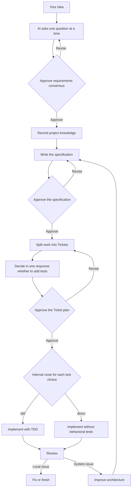

# Ask Then Do It: A Beginner's Workflow Guide

Ask Then Do It teaches an AI to clarify the work before writing code. You do not need software engineering experience; answer the one question the AI asks in each round.

## Remember one sentence

```text
Ask first, record the agreement, then build.
```

It is like building a house: first decide who will live there and how many rooms are needed, then draw the plan, divide the work, build, and inspect it.

## Complete workflow



## 1. Ask one question at a time

The AI starts with the question that has the greatest effect on the result. It also provides a recommended answer and the main tradeoff.

If you say, "I want an appointment website," the AI might first ask, "Who can create an appointment?" It waits for your answer before asking the next question.

Formal implementation must not begin before you approve the requirements consensus.

## 2. Save project knowledge

The Project Knowledge Base is a shared notebook for confirmed terms, architecture, and important decisions. When you start a new conversation, the AI can use it to continue without relearning everything.

Unapproved ideas remain temporary notes and must not be treated as final decisions.

## 3. Write the specification

The specification describes how the result should behave. For example:

- A user can choose a date and time.
- A reserved time cannot be selected again.
- A confirmation message appears after booking.

This stage describes behavior instead of inserting production code. Once the content is correct, you give the second approval.

## 4. Split the work into Tickets

The AI divides the larger job into small tasks that can be completed independently. Each Ticket should deliver a visible result, not only "build the database" or "build the screen."

After listing every Ticket, the AI gives each one a test recommendation. For every Ticket, it warns that adding tests may increase work time while declining them lowers confidence. In one response, you decide whether to add tests to every Ticket: add them to all, add them to none, or name only the Tickets that should have tests. If the rest are not specified, the AI asks only about unresolved Tickets. After confirming the complete list, order, and test choices, you give the third approval.

## 5. Implement using the selected mode

For a `tdd` Ticket, `$implement-tdd` uses three steps:

1. `Red`: Write a test and show that it fails because the feature is missing.
2. `Green`: Add the smallest implementation needed to make the test pass.
3. `Refactor`: Improve the code while keeping the tests passing.

Test results are implementation evidence. The AI should provide actual results instead of saying the feature "should work."

For a `direct` Ticket, `$implement-direct` implements the approved work without creating or running behavioral tests. It may still run lint, type-check, or build checks. Its evidence and Review must state `tests: skipped-by-user` and explain what remains untested.

## 6. Review the result

Review compares the requirements, specification, code changes, and test results. It looks for errors, duplicated logic, excessive complexity, and code that will be difficult to maintain.

If information is missing, the AI should say what cannot be verified rather than assume everything is correct.

## 7. Improve architecture

When a system-wide issue affects several modules, the AI first analyzes the problem, impact, and possible direction. It does not immediately begin a large refactor.

After you accept the analysis, the workflow returns to the specification and Ticket plan before any changes begin.

## Start in Codex

After installing the Plugin, enter this in a new Codex task:

```text
$ask-then-do-it I want to build...
```

The AI identifies current progress and begins asking one question at a time. Approved `direct` Tickets route to `$implement-direct`.

## Start in Gemini or another AI

Paste `generic-workflow.md` into every new conversation, then describe your request. This package guides the process through conversation. Whether it can edit files or run tests depends on the tools offered by the AI service.

## When starting a new conversation

Save the important documents from each stage. In a new conversation, provide:

1. The Ask Then Do It workflow or Plugin.
2. Your saved requirements, Project Knowledge Base, specification, Tickets, and Review.
3. What you want to continue or change.

The AI should continue from the first unfinished stage.

## Final check

- [ ] The AI asks only one question at a time.
- [ ] You approved the requirements, specification, and Ticket plan.
- [ ] After the time-and-risk warnings, you decided in one response whether to add tests to every Ticket.
- [ ] TDD includes actual Red, Green, and Refactor results; direct implementation states `tests: skipped-by-user`.
- [ ] Review distinguishes verified facts from missing evidence.
- [ ] Architecture problems are analyzed before returning to specification and Ticket planning.
