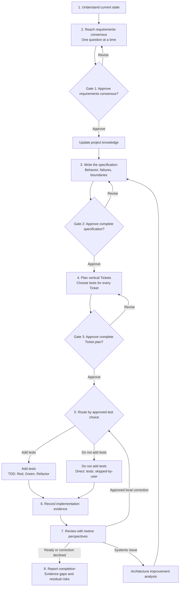
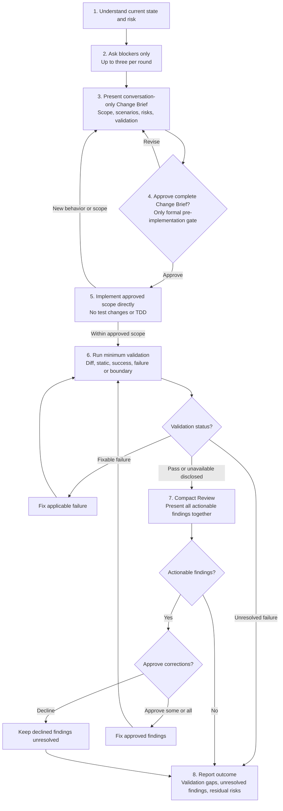

# Ask Then Do It: A Beginner's Workflow Guide

Ask Then Do It offers two workflows: `Full` and `Lite`. Full is for work that needs a complete decision record and stronger verification confidence. Lite is for well-bounded, lower-risk work where reducing workflow text matters.

Both modes clarify scope, obtain user authority, preserve existing changes, and report verification honestly before claiming completion. Lite is smaller than Full; it is not permission to skip risk checks or validation.

## Mode precedence

At the start of each operation, Codex resolves the mode in this order:

1. An explicit instruction for the current operation, such as "use Full this time" or "use Lite this time."
2. Project Config.
3. User Config.
4. Full fallback when no valid setting applies.

An explicit instruction for the current operation affects only that operation and is not written to Config. Project Config affects only its project; other sessions continue to use Config. See the [Codex Plugin Guide](codex.en.md) for Config paths, format, and error handling.

The Generic workflow cannot read Codex Config. It instead uses the default-mode declaration near the start of the pasted workflow; an explicit current-operation instruction still wins, and a missing or invalid declaration uses Full. See the [Generic Guide](generic.en.md) for details.

## Full and Lite compared

| Comparison | Full | Lite |
| --- | --- | --- |
| Best fit | High risk, cross-module work, unresolved requirements, or a complete audit trail | Well-bounded, lower-risk changes |
| Questions | One at a time until requirements consensus | Up to three blockers per round, about 500 tokens for the batch |
| Workflow documents | Keeps requirements, project knowledge, specification, Ticket plan, and implementation evidence | Keeps the Change Brief in the conversation and creates no workflow documents |
| Approval before implementation | Three gates: requirements, specification, and Ticket plan | One gate for the Change Brief |
| Tests | The user decides whether each Ticket adds tests | Adds or modifies no tests and does not use TDD |
| Validation | Complete, traceable verification proportional to Ticket mode and risk | Static checks plus one success and one failure or boundary path |
| Review | Independent twelve-perspective Review with evidence | Compact Review by the same AI; user approval still precedes finding corrections |
| Traceability | High and resumable across sessions | Lower; unpersisted workflow state does not continue into a new session |

## Full mode

Full asks one requirements question at a time and keeps documents that another session can inspect. Full has three formal approval gates: requirements consensus, the specification, and the Ticket plan.



1. **Understand the current state.** The AI reads repository instructions, related code, tests, configuration, and current changes without touching unrelated work.
2. **Reach requirements consensus.** It asks one requirements question at a time with a recommendation and main tradeoff. Your approval permits the project knowledge record to be updated and is the first gate.
3. **Write the specification.** The specification defines observable behavior, failures, and boundaries without inserting production code. Your approval of the complete specification is the second gate.
4. **Split the work into vertical Tickets.** Each Ticket delivers an independently verifiable outcome. The AI recommends a test choice for each Ticket, warns that running tests may add time and declining tests lowers confidence, then asks in one response whether to add tests to every Ticket. Your approval of the complete Ticket plan is the third gate.
5. **Implement according to the test choice.** Within Full, adding and declining tests map internally to `tdd` and `direct`; users do not need to answer with those internal names.
6. **Keep implementation evidence.** `$implement-tdd` records actual `Red`, `Green`, and `Refactor` results. `$implement-direct` creates and runs no behavioral tests, but may run lint, type-check, or build checks and records `tests: skipped-by-user` with the untested behavior.
7. **Review.** Review compares the approved material, diff, and verification through twelve perspectives. A systemic issue receives architecture improvement analysis and returns through specification and Ticket planning instead of silently expanding the change.
8. **Complete.** The AI reports delivered behavior, observed verification, unavailable evidence, and residual risks. Saved workflow documents allow a later session to continue.

Silence, an unrelated response, or an AI-generated status change cannot replace any approval.

## Lite mode

Lite uses less workflow text for a bounded change. It asks up to three blocking questions per round and asks only about decisions that prevent implementation or materially redirect it.



1. **Understand current state and risk.** The AI inspects only instructions, changes, code, tests, configuration, and documentation relevant to this operation, then evaluates material risk before proposing work.
2. **Ask only blockers.** It asks up to three blocking questions per round, ranked by impact and uncertainty. Each question uses at most three short sentences, asks one decision, and includes a recommendation plus the main tradeoff. The whole batch targets about `500 tokens`; it does not invent filler, and it reassesses lower-priority blockers after the answers.
3. **Present the Change Brief.** The Change Brief targets about `800 tokens` and states the objective, in-scope behavior, explicit non-goals, three to five observable acceptance scenarios, material risks, and intended validation. If material information cannot fit honestly, the AI recommends Full.
4. **Obtain one approval.** Lite has exactly one formal approval gate: explicit approval of the complete Change Brief before any production modification. Lite does not create or update workflow artifact files; the brief, progress, and Review exist only in this conversation.
5. **Implement the approved scope directly.** Lite does not add or modify tests, does not use `Red`, `Green`, or `Refactor`, and does not claim TDD-equivalent confidence. Materially new behavior or scope requires another user decision before work continues.
6. **Run minimum validation.** The AI inspects final file scope and diff, runs applicable syntax, lint, type-check, build, configuration, schema, or equivalent static checks, then uses an existing focused test or manual smoke check for one principal success path and one most important failure or boundary path. An applicable failure is corrected and rerun; unavailable checks are disclosed, and a known unresolved failure prevents an unqualified completion claim.
7. **Perform compact Review.** The same AI checks Change Brief coverage, diff scope, failure and security paths, unavailable validation, and residual risk. It presents every actionable finding in one batch and obtains approval before making corrections, then reruns relevant validation. Declined findings remain unchanged and are reported as unresolved. When there are zero actionable findings, the AI says so and does not create an empty correction approval gate.
8. **Report completion.** A normal completion response normally targets about `500 tokens` and lists delivered behavior, changed areas, observed validation and outcomes, unavailable checks, unresolved findings, and residual risks. Failures, blockers, security concerns, missing or unavailable evidence, and unresolved findings may exceed the target and must never be hidden to save tokens.

## High-risk operations

Authentication and authorization, payment, data migration, destructive data operations, public contracts, cross-module structure, concurrency or asynchronous work, and external side effects can need Full's stronger traceability.

When Lite finds such evidence before implementation, it explains the risk and asks whether to switch only the current operation to Full. You may instead accept the risk and continue in Lite. This choice is not written to Config, and other sessions continue to use Config.

If material risk appears during implementation, the AI stops further modification and asks again. Switching preserves observable current changes and returns to the earliest unmet Full gate before implementation continues. With no mode decision, work remains paused.

## Start in Codex

After installing the Plugin, enter this in a new Codex task:

```text
$ask-then-do-it I want to build...
```

Without an explicit mode instruction, the AI uses Config to choose Full or Lite. An approved Full `direct` Ticket routes to `$implement-direct`; Lite follows the single Change Brief flow above.

## Start in Gemini or another AI

Paste `generic-workflow.md` into every new conversation before describing the request. The Generic workflow acts only within its real tool capabilities; a conversation-only host must not claim to have edited files or run validation.

## Starting a new session

A new session resolves the mode again instead of reusing the prior operation's temporary choice. Full can resume from saved documents. Lite has no cross-session state for its Change Brief, approval, progress, or Review, so it reconstructs a new brief from current repository state when needed.

## Final check

- [ ] Mode followed current-operation instruction, project Config, user Config, then Full fallback.
- [ ] Full obtained approval for requirements, specification, and Ticket plan and asked in one response whether to add tests to every Ticket.
- [ ] Lite has one approved Change Brief and created neither new tests nor workflow documents.
- [ ] Observed validation, unavailable checks, unresolved findings, and residual risks are disclosed.
- [ ] A high-risk switch affects only the current operation and does not change Config behavior for another session.


[Back to README](../../README.md)
