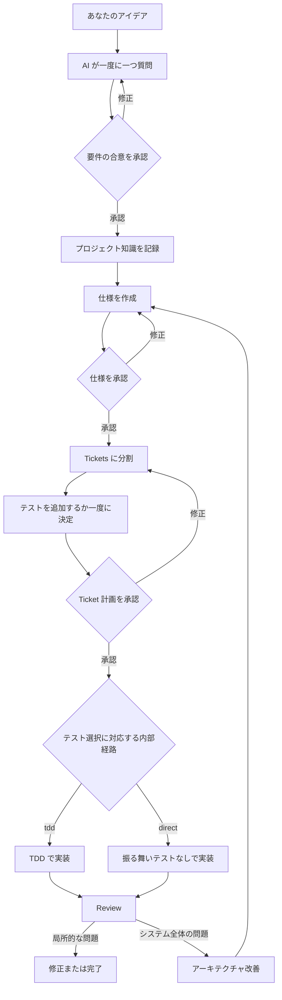

# Ask Then Do It：初心者向けフロー

Ask Then Do It は、コードを書く前に作業内容を確認するよう AI に教えます。ソフトウェア開発の知識は必要ありません。AI が一度に一つずつ行う質問に答えてください。

## 覚えることは一つ

```text
最初に確認し、合意を残してから、作り始める。
```

家を建てる場合と同じです。誰が住むのか、部屋はいくつ必要かを確認してから、設計、分担、建築、点検へ進みます。

## フロー全体



## 1. 一度に一つ質問する

AI は結果への影響が最も大きい質問から始めます。質問には推奨回答と主なトレードオフも添えられます。

「予約サイトを作りたい」と伝えた場合、AI は最初に「誰が予約を作成できますか」と質問するかもしれません。回答してから次の質問へ進みます。

要件の合意を承認するまでは、正式な実装を始めません。

## 2. プロジェクト知識を保存する

Project Knowledge Base は、確認済みの用語、アーキテクチャ、重要な決定を残す共有ノートです。新しい会話を始めたときも、AI はその内容を使って続けられます。

まだ承認されていないアイデアは一時的なメモとして扱い、正式な決定にはしません。

## 3. 仕様を書く

仕様には完成後の動作を記述します。たとえば：

- 利用者が日付と時刻を選べる。
- 予約済みの時間は再び選べない。
- 予約後に確認メッセージが表示される。

この段階では動作を説明し、本番用コードは書きません。内容が正しいことを確認したら、2 回目の承認を行います。

## 4. Tickets に分ける

AI は大きな作業を、個別に完成できる小さな作業へ分けます。各 Ticket は目に見える結果を届ける必要があり、「データベースだけを作る」「画面だけを作る」という分け方はしません。

すべての Tickets が示された後、AI は各 Ticket のテスト方針を提案します。Ticket ごとに、テストを追加すると作業時間が増える可能性があり、追加しないと確認の信頼度が下がることを説明します。すべての Ticket についてテストを追加するかどうかを一度に回答でき、全部に追加、全部に追加しない、または一部だけを指定できます。残りを説明しなかった場合、AI は未決定の Tickets だけを確認します。完全な一覧、順序、テスト選択を確認してから、3 回目の承認を行います。

## 5. 選択したモードで実装する

`tdd` Ticket では、`$implement-tdd` が次の 3 段階を行います。

1. `Red`：テストを先に書き、機能が未完成なので失敗することを確認します。
2. `Green`：テストを通すために必要な最小限の実装を追加します。
3. `Refactor`：テストを通したままコードを整理します。

テスト結果は実装の根拠です。AI は「動くはず」と言うだけでなく、実際の結果を提示します。

`direct` Ticket では、`$implement-direct` が振る舞いテストを作成も実行もせず、承認済みの作業を実装します。lint、型チェック、build は実行できます。根拠と Review には `tests: skipped-by-user` を記録し、未テストの範囲を説明します。

## 6. 結果を Review する

Review では、要件、仕様、コード差分、テスト結果を照らし合わせます。誤り、重複した処理、過度な複雑さ、保守しにくい部分を探します。

情報が不足している場合、問題がないと推測せず、何を確認できないかを明確にします。

## 7. アーキテクチャを改善する

複数のモジュールに影響する問題がある場合、AI は最初に問題、影響、改善の方向を分析します。すぐに大規模な変更を始めることはありません。

分析を受け入れた後、仕様と Ticket 計画へ戻り、変更を始めるか判断します。

## Codex で始める

Plugin をインストールした後、新しい Codex タスクで次のように入力します。

```text
$ask-then-do-it 作りたいものは……
```

AI は現在の進捗を判断し、一度に一つずつ質問を始めます。承認済みの `direct` Ticket は `$implement-direct` に進みます。

## Gemini またはその他の AI で始める

新しい会話ごとに `generic-workflow.md` を貼り付けてから、要望を伝えます。このパッケージは会話の中で進行を案内します。ファイル操作やテスト実行ができるかどうかは、AI サービスが提供するツールによって異なります。

## 新しい会話を始めるとき

各段階の重要な文書を保存してください。新しい会話では、次のものを提示します。

1. Ask Then Do It のワークフローまたは Plugin。
2. 保存した要件、Project Knowledge Base、仕様、Tickets、Review。
3. 今回続けたいこと、または変更したいこと。

AI は最初の未完了段階から続けます。

## 最後の確認

- [ ] AI は一度に一つだけ質問する。
- [ ] 要件、仕様、Ticket 計画をそれぞれ承認した。
- [ ] 時間とリスクの説明後、すべての Ticket にテストを追加するか一度に回答した。
- [ ] TDD には Red、Green、Refactor の実際の結果があり、direct 実装には `tests: skipped-by-user` が記録されている。
- [ ] Review で確認済みの内容と不足している根拠が区別されている。
- [ ] アーキテクチャ問題は、仕様と Ticket 計画へ戻る前に分析されている。
