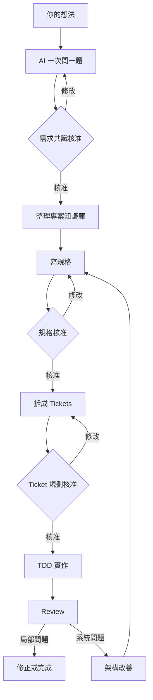

# Ask Then Do It 初學者流程

Ask Then Do It 教 AI 先把事情問清楚，再開始寫程式。你不需要先懂軟體工程，只要回答 AI 每次提出的一個問題。

## 先記住一句話

```text
先問清楚，寫下共識，再開始做。
```

這就像蓋房子：先確認誰要住、需要幾個房間，再畫圖、分工、施工和檢查。

## 完整流程



## 1. 一次問一題

AI 會先問最影響結果的問題，並附上建議答案與主要取捨。

例如你說「我要做預約網站」，AI 可能先問：「誰可以建立預約？」你回答後，它才問下一題。

在需求共識核准以前，AI 不應開始正式實作。

## 2. 保存專案知識

專案知識庫像一本共用筆記，保存已確認的名詞、架構與重要決定。之後換新對話時，AI 可以根據這些內容繼續，不必從頭說明。

還沒核准的想法只能當作暫時筆記，不能直接變成正式決定。

## 3. 寫規格

規格說明成品應該怎麼運作，例如：

- 使用者可以選擇日期和時間。
- 已被預約的時間不能再次選擇。
- 預約完成後要顯示確認訊息。

規格描述行為，不在這個階段塞入正式程式碼。確認內容正確後，你要進行第二次核准。

## 4. 拆成 Tickets

AI 會把大工作拆成可以獨立完成和測試的小任務。每張 Ticket 都要交付一個看得見的結果，而不是只寫「先做資料庫」或「先做畫面」。

確認執行順序與範圍後，你要進行第三次核准。

## 5. 用 TDD 實作

TDD 分成三步：

1. `Red`：先寫測試，確認它會因為功能尚未完成而失敗。
2. `Green`：加入最少的實作，讓測試通過。
3. `Refactor`：整理程式，同時保持測試通過。

測試結果是實作證據。AI 不能只說「應該可以」，而要提供實際結果。

## 6. Review 成果

Review 會重新對照需求、規格、程式差異與測試結果，找出錯誤、重複邏輯、過度複雜或難以維護的地方。

若資料不足，AI 應直接說明無法確認，而不是猜測已經沒問題。

## 7. 架構改善

遇到影響多個模組的系統問題時，AI 先分析問題、影響與改善方向，不會立刻大規模重構。

你接受分析後，流程會回到規格與 Ticket 規劃，再決定是否動工。

## 在 Codex 開始

安裝 Plugin 後，在新的 Codex 任務輸入：

```text
$ask-then-do-it 我想做一個……
```

AI 會判斷目前進度並開始一次問一題。

## 在 Gemini 或其他 AI 開始

每個新對話都先貼上 `generic-workflow.md`，再說明需求。這個版本只在對話中引導流程；能否直接操作檔案或執行測試，取決於你使用的 AI 服務。

## 換新對話時

保存每個階段的重要文件。開啟新對話時，提供：

1. Ask Then Do It 的工作流或 Plugin。
2. 已保存的需求、專案知識庫、規格、Tickets 與 Review。
3. 這次想繼續或修改的內容。

AI 應從第一個尚未完成的階段繼續。

## 最後檢查

- [ ] AI 每次只問一題。
- [ ] 需求、規格與 Ticket 規劃都有你的核准。
- [ ] TDD 有 Red、Green、Refactor 的實際結果。
- [ ] Review 清楚區分已確認與無法確認的內容。
- [ ] 架構問題先分析，再回到規格與 Ticket 流程。
