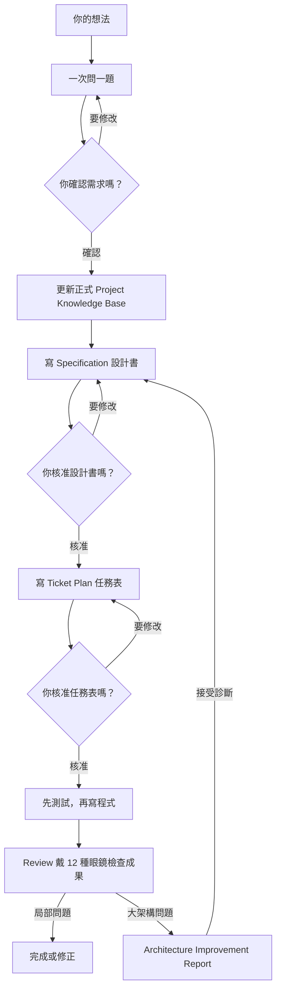

# Grill Me 超簡單使用說明

這份說明寫給第一次使用 Grill Me 的人。就算你只有小學三年級，也可以跟著做。

Grill Me 是一套教 AI「不要急著寫程式」的方法。它會先問清楚你想做什麼，再寫設計、分工作、做測試，最後檢查成果。

## 先記住一句話

```text
先想清楚，再寫清楚，然後才開始做。
```

這就像蓋一間小屋：

- 先問「誰要住？要多大？」
- 再畫設計圖。
- 把工作分成小步驟。
- 一步一步蓋。
- 最後檢查門窗是不是安全。

如果一開始就亂蓋，最後很可能要拆掉重來。

## 整個流程

```text
你的想法
   ↓
AI 一次問一題
   ↓
需求共識：大家同意要做什麼
   ↓
Project Knowledge Base：保存已核准的專案筆記
   ↓
Specification：寫清楚成品應該怎麼表現
   ↓
Ticket Plan：把大工作分成小任務
   ↓
TDD：先做測試，再寫程式
   ↓
Review：戴上 12 種眼鏡檢查成果
   ↓
有大架構問題時，先寫 Architecture Improvement Report
   ↓
完成
```



## 開始前：AI 先看自己有幾隻手

不同 AI 能做的事不一樣。

| 能力 | 簡單意思 | AI 可以做什麼 |
| --- | --- | --- |
| `conversation` | 只有嘴巴和腦袋 | 聊天、問問題、寫文件 |
| `tools` | 還有可以工作的手 | 讀寫檔案、執行命令、跑測試 |
| `multi_agent` | 還有其他小幫手 | 分工，或請另一個 AI 獨立檢查 |

AI 必須先說明自己真的有哪些能力。

如果只有 `conversation`，它不能說：

- 「我已經改好程式了。」
- 「所有測試都通過了。」
- 「我已經把檔案保存好了。」

因為它其實沒有手可以做這些事。

## 階段一：問清楚你要什麼

這個階段叫做 Requirements，也就是「需求」。

AI 會像一位很有耐心的小記者：

- 每次只問一題。
- 告訴你它建議選哪一個答案。
- 告訴你這個建議有什麼好處和代價。
- 問完就停下來等你回答。

例如：

```text
問題：誰可以看到這份任務？

建議：只有被邀請的隊員可以看到。

主要取捨：比較安全，但是邀請隊員會多一個步驟。
```

你可以回答自己的想法，也可以回答：

```text
採用建議
```

### 要不要把專案知識一起保存？

如果只是全新的小問題，可以用一般 Requirements。

如果正在修改舊系統、已經有專案筆記，或這次會談到很多專有名詞與架構，AI 會使用 `$grill-with-docs`。

它像一位一邊訪問、一邊整理筆記的小記者：

- 還沒正式核准的內容放在 Draft Working Notes。
- `proposed` 是「可能是這樣」。
- `confirmed` 是「你在對話中說對」，但還沒正式核准。
- `unresolved` 是「現在還不知道」。

正式 Project Knowledge Base 像班級的公用筆記本，只能放有批准證據的內容。AI 會先告訴你要新增、修改或移除什麼，等你說「核准」後才能更新。

### 這個階段的成果

AI 會寫一份 Requirement Decision Record。

它就像「我們已經說好的事情」筆記，會記錄：

- 要解決什麼問題。
- 誰會使用。
- 要做哪些功能。
- 哪些事情這次不做。
- 怎樣才算成功。
- 還有哪些事情以後再決定。

第一份一定是 `Draft`，意思是「草稿」。

AI 會問你是否確認。只有你清楚回答「確認」，它才能改成 `Approved`，意思是「已核准」。

## 階段二：寫 Specification 設計書

Specification 可以想成小屋的設計圖。

它不急著說要用哪一顆螺絲，而是先寫清楚：

- 使用者做一件事時，系統應該怎麼回答。
- 遇到錯誤時要怎麼辦。
- 哪些資料可以看，哪些不能看。
- 舊功能不能被弄壞。
- 要看到什麼結果，才算完成。

### 這個階段不能做什麼

Specification 不能偷偷開始寫正式程式。

如果設計書裡出現新的大決定，AI 應該回到上一階段問你，不能自己猜答案。

### 第二次需要你說「好」

AI 先交出 `Draft Specification`。

你可以：

```text
核准這份 Specification。
```

或是：

```text
請修改第 3 點，訪客不能刪除任務。
```

只有你核准後，才能進入下一階段。

## 階段三：把大工作分成小任務

這個階段叫做 Ticket Planning。

Ticket 就像一張小任務卡。每張卡都要完成一個看得見的結果。

好的分法：

```text
Ticket 1：使用者可以建立一個任務，並在畫面上看到它。
Ticket 2：使用者可以把任務指派給隊員。
Ticket 3：使用者可以完成任務，並看到完成時間。
```

不好的分法：

```text
先做完所有資料庫。
再做完所有 API。
最後才做所有畫面。
```

不好的分法會讓你很久都看不到可以使用的成果。

### 第三次需要你說「好」

AI 會先交出 `Draft Ticket Plan`。

你核准後，AI 才能開始實作：

```text
核准這份 Ticket Plan，從 Ticket 1 開始。
```

這是開始寫正式程式以前的最後一道門。

## 階段四：先測試，再寫程式

這個方法叫做 TDD。

可以把它想成先出一道考題，再教程式答對。

### Red：先看到紅燈

AI 先寫一個測試，並真的執行它。

因為功能還沒有完成，測試應該失敗。這叫做 Red。

Red 可以證明這個測試真的抓得到缺少的功能。

### Green：讓燈變綠

AI 寫最少但完整的程式，讓測試通過。這叫做 Green。

### Refactor：把房間整理乾淨

測試通過後，AI 可以整理程式，讓它比較好讀、比較好維護。

整理後要再跑一次測試，確認沒有弄壞。

### AI 必須拿出證據

AI 不能只說「測試成功」。它應該告訴你：

- 執行了什麼命令。
- 一開始為什麼失敗。
- 改了哪些檔案。
- 後來哪些測試通過。
- 還有哪些風險。

如果是 Generic prompts，AI 只有 `conversation` 能力，就只能產生：

```text
UNEXECUTED IMPLEMENTATION GUIDANCE
```

意思是「這是還沒有真的執行的實作建議」。它不能假裝已經改好程式。

## 階段五：Review 檢查成果

Review 就像老師改作業，也像房屋檢查員檢查小屋。

Review 會檢查：

- 有沒有符合 Specification。
- 有沒有漏掉錯誤情況。
- 有沒有安全問題。
- 測試是不是真的有用。
- 有沒有弄壞舊功能。
- 程式是不是太難理解。

最好的 Review 由另一個沒有參與施工的 AI 執行。這樣比較不容易因為「自己覺得自己做得很好」而漏掉問題。

如果只有同一個聊天 AI 可以檢查，它必須標示：

```text
Review label: limited-evidence
Independence: non-independent
```

意思是「看到的證據有限，而且不是獨立檢查」。

### Review 會戴上 12 種眼鏡

這不是用真的眼鏡，而是用 12 種不同角度看程式：

- 有沒有同一規則到處重複。
- 函式、類別或參數是不是太大、太長。
- 同一群資料是不是總綁在一起。
- 程式是不是太依賴別人的資料。
- 改一件事是不是要散改很多地方。
- 呼叫鏈是不是太長。
- 模組是不是看起來很複雜，實際上沒藏住多少事情。

完整規則共有 12 項。每一項都要說明是發現問題、沒有發現、這次不適用，或證據不足，不能偷偷跳過。

## 階段六：只檢查架構，不急著拆房子

如果 Review 發現大問題，AI 可以使用 `$improve-architecture`。

它會先寫一份 Architecture Improvement Report，像房屋檢查報告。它可以做「模擬刪除」：想像拿掉一面牆會影響什麼，但不會真的把牆打掉。

只有你另外清楚同意、有真的工具，而且是在可以丟掉的隔離副本裡，才可以做實際刪除實驗。

就算你接受報告，也只是同意「問題真的存在」。AI 還是要重新寫 Specification、Ticket Plan，再用 TDD 實作，不能直接大改程式。

## 八個 Skills 像八位隊員

| Skill | 像誰 | 工作 |
| --- | --- | --- |
| `$ai-dev-workflow` | 隊長 | 看現在走到哪裡，安排下一位隊員 |
| `$grill-requirements` | 小記者 | 一次問一題，把需求問清楚 |
| `$grill-with-docs` | 筆記記者 | 一次問一題，還會整理專案知識 |
| `$write-spec` | 設計師 | 寫 Specification 設計書 |
| `$plan-tickets` | 任務管理員 | 把大工作拆成小 Tickets |
| `$implement-tdd` | 工程師 | 先測試，再寫程式，最後整理 |
| `$review-code` | 檢查員 | 找錯誤、風險和漏掉的事情 |
| `$improve-architecture` | 房屋健檢員 | 找大架構問題，但不直接拆改 |

通常從 `$ai-dev-workflow` 開始就好。隊長會判斷該請誰工作。

## 在 Codex 裡怎麼用

先安裝並啟用 Grill Me Plugin，再開一個新的 Codex task。

輸入：

```text
使用 $ai-dev-workflow 幫我開發一個班級借書系統。
目前只有想法，請先不要寫程式。
```

Codex 應該先說明能力，再開始一次問一題。

也可以不寫 Skill 名稱，直接說明一個重大又不清楚的開發需求。Codex 可能會自動選擇 `$ai-dev-workflow`。

如果你一定要它使用完整流程，明確寫出 `$ai-dev-workflow` 最可靠。

Codex 的安裝、更新與移除方式請閱讀 [Codex Plugin 使用說明](codex.zh-TW.md)。

## 在 Gemini 或其他 AI 裡怎麼用

開啟建置後的 `dist/generic-prompts-2.1.0/generic-workflow.md`，複製全部內容，貼到一個新的 AI 對話。

接著輸入：

```text
我想開發一個班級借書系統。
老師可以登記書本，同學可以借書和還書。
請先幫我把需求問清楚，不要假裝已經寫好程式。
```

正確的 AI 應該：

1. 說明它只有 `conversation` 能力。
2. 判斷目前沒有舊的 Artifacts。
3. 進入 Requirements。
4. 只問一題。
5. 提供建議和主要取捨。
6. 停下來等你回答。

完整 Generic 用法請閱讀 [Generic prompts 使用說明](generic.zh-TW.md)。

## 換新對話時，不要忘記帶上筆記

一般聊天 AI 可能不記得上一個對話。

所以每次 AI 產生重要 Artifact，你都要把完整內容保存下來：

- Requirement Decision Record。
- Specification。
- Ticket Plan。
- Implementation Evidence 或未執行交接。
- Review Report。
- Project Knowledge Base 與 Draft Working Notes。
- Architecture Improvement Report。

換新對話時，把這些內容重新貼給 AI，並說：

```text
請檢查這些 Artifacts，從第一個還沒有完成的階段繼續。
```

不能只說「上一個 AI 已經核准」，因為新 AI 看不到證據。

## 怎麼知道 AI 有沒有做對

你可以用這張檢查表：

- [ ] AI 有先說明自己真正的能力。
- [ ] Requirements 每次只問一題。
- [ ] 每一題都有建議和主要取捨。
- [ ] Requirement、Specification、Ticket Plan 都先是 `Draft`。
- [ ] AI 有等你明確核准。
- [ ] 三次核准完成前，AI 沒有偷寫正式程式。
- [ ] 有工具的 AI 先看到測試失敗，再寫程式。
- [ ] AI 有提供真正的命令與測試結果。
- [ ] 沒有工具的 AI 沒有假裝做過事情。
- [ ] Review 有說明證據是否有限、是否獨立。
- [ ] Project Knowledge Base 只包含已核准的內容。
- [ ] Review 的 12 項都有結果或理由。
- [ ] 架構報告沒有直接跳到重構。

## 如果 AI 做錯了怎麼辦

可以直接提醒它：

```text
你一次問了很多題。請遵守 Grill Me，每次只問一題，並提供建議和主要取捨。
```

```text
我還沒有核准 Specification。請不要開始實作，先停在核准點。
```

```text
你只有 conversation 能力。請不要聲稱已修改檔案或執行測試。
```

```text
請回到最早出錯的階段，更新 Artifact，並保持 Draft。
```

## 最後再記一次

Grill Me 不是叫 AI 做得更快，而是幫助 AI 少做錯事。

```text
問清楚 → 寫清楚 → 分小步 → 先測試 → 再施工 → 最後檢查
```

只要記得三件事，就不容易迷路：

1. 一次回答一個問題。
2. 看懂後再說「核准」。
3. 保存每一份重要 Artifact。
